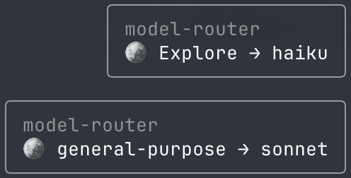

# claude-code-mods

A few mods for [Claude Code](https://claude.com/claude-code), packaged as a plugin marketplace.

| Mod | What it does |
|-----|--------------|
| **pomodoro** | A pixel-art pomodoro timer in a side pane. Day and night skies, animated sun, clouds, stars and meteors, a grass field and a daily tomato tally. Toast and chime when a phase ends. |
| **agent-progress** | Live Powerline-style progress bars for running subagents, with a moving glint and the model each one runs on. |
| **cmd-guard** | Stops destructive shell commands (`rm -rf` on `/`, `~` or `*`, force pushes, hard resets, dropping tables, `mkfs`, `dd`…) and asks what to do: refuse, allow once, trust for this session, or use a safer alternative. |
| **model-router** | Runs Explore subagents on haiku and general-purpose subagents on sonnet to save cost. An explicit `model` on the Agent call always wins; forks and workflows are left alone. Optionally lets [Jev](https://typesafe.ai) pick the model per task. |

<p align="center">
  
  &nbsp;
  
</p>

<p align="center"><em>pomodoro — focus by day, break by night</em></p>

## Install

```sh
claude plugin marketplace add redjackfred/claude-code-mods
claude plugin install pomodoro@claude-code-mods
claude plugin install agent-progress@claude-code-mods
claude plugin install cmd-guard@claude-code-mods
claude plugin install model-router@claude-code-mods
```

Install only the ones you want. Restart Claude Code afterwards.

## Usage

### pomodoro

```
/focus [minutes]   start a focus session (default 25)
/focus skip        skip to the next phase
/focus stop        stop the timer
/focus show|hide   show or hide the side pane
```

- Runs entirely locally: the timer never calls the model and costs no tokens.
- Best in a terminal with a [Nerd Font](https://www.nerdfonts.com/) and Unicode 13 sextant glyphs (Ghostty, WezTerm, Kitty, iTerm2…).
- The chime plays through `afplay`, so sound is macOS only.

### agent-progress


`/agent-progress` toggles the bars on and off.

### cmd-guard


Works automatically; `/guard off` turns it off for the session and `/guard on` back on. When nobody answers the prompt (or it fails), the command is blocked.

The dialog speaks the language you mostly write in during the session: English, or Traditional Chinese (繁體中文).

It matches commands with regexes, not a shell parser, so treat it as a seatbelt against slips rather than a sandbox: a determined command can still get past it. It also can't tell running a command from mentioning one, so a commit message or heredoc that only quotes a risky command gets stopped too. Reword the text, or `/guard off` for a moment.

### model-router



Works automatically and shows a toast for each subagent it reroutes. To steer the main agent, you can add this to your `~/.claude/CLAUDE.md`:

```md
A model-router mod runs Explore subagents on haiku and general-purpose ones on sonnet
unless the Agent call names a model. For complex reasoning, large refactors, or
hard-to-find bugs, pass `model: "opus"` on the Agent call.
```

#### Optional: let Jev pick the model

[Jev](https://typesafe.ai) is a fast "System One" decision model. With it on, each general-purpose subagent's task is classified as haiku, sonnet or opus work before it starts. In a quick test it took about 0.7 s per call and costs well under a cent.

```sh
export TYPESAFE_API_KEY=...   # then restart Claude Code
/router jev on                # /router jev off to stop
```

- **Privacy:** it's off by default because turning it on sends each general-purpose task (its description plus the first 4000 characters of the prompt) to TypeSafe's API.
- **Confidence:** Jev's pick is used only when its confidence is at least 0.8.
- **Fallback:** if Jev is slow (over 1.5 s), fails, or isn't sure, the subagent falls back to sonnet.
- **Explore subagents** always stay on haiku.
- **Toast:** shows Jev's pick, e.g. `general-purpose → haiku · jev 1.00`.

## Development

Each mod is a Claude Code plugin with TypeScript hooks in `hooks/`.

```sh
claude plugin validate .        # the marketplace
claude plugin validate pomodoro # one plugin
claude plugin test pomodoro     # its tests
```

## License

MIT
