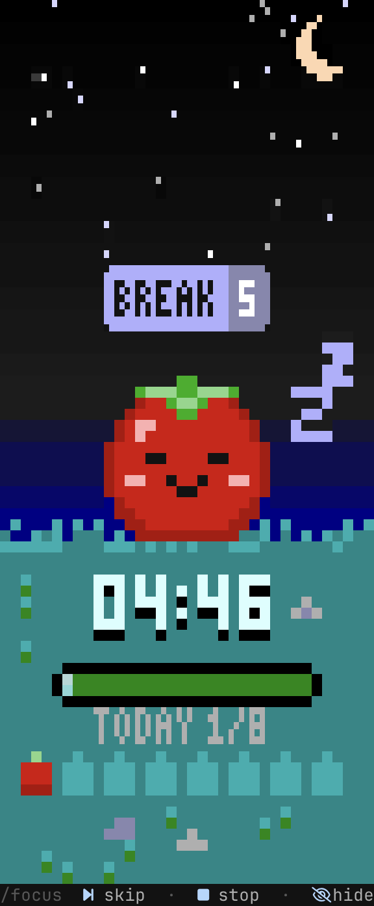
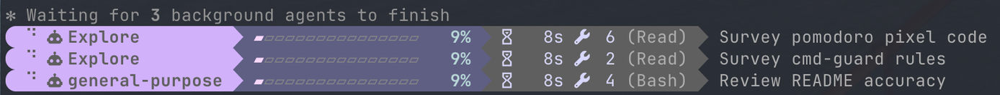
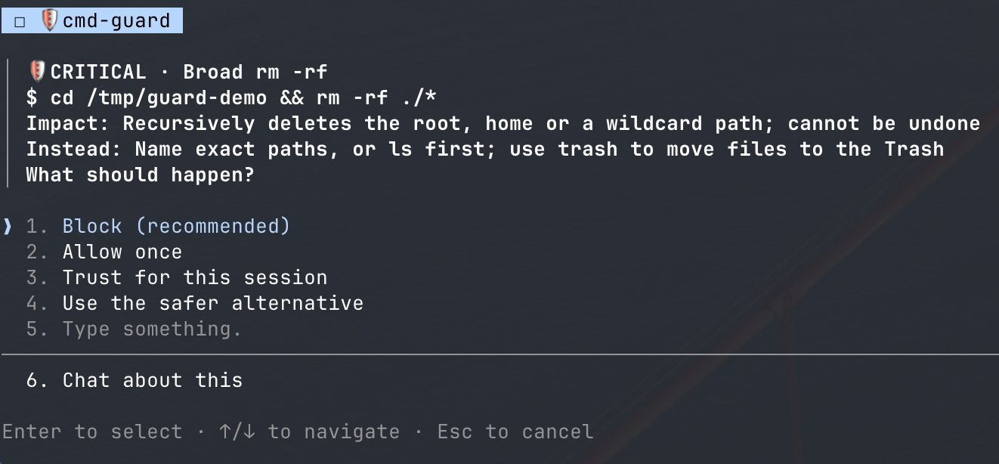

# claude-code-mods

A few mods for [Claude Code](https://claude.com/claude-code), packaged as a plugin marketplace.

| Mod | What it does |
|-----|--------------|
| **pomodoro** | A pixel-art pomodoro timer in a side pane. Day and night skies, animated sun, clouds, stars and meteors, a grass field and a daily tomato tally. Toast and chime when a phase ends. |
| **agent-progress** | Live Powerline-style progress bars for running subagents, with a moving glint. |
| **cmd-guard** | Stops destructive shell commands (`rm -rf` on `/`, `~` or `*`, force pushes, hard resets, dropping tables, `mkfs`, `dd`…) and asks what to do: refuse, allow once, trust for this session, or use a safer alternative. |
| **model-router** | Runs Explore subagents on haiku and general-purpose subagents on sonnet to save cost. An explicit `model` on the Agent call always wins; forks and workflows are left alone. |

<p align="center">
  
  &nbsp;
  
</p>

<p align="center"><em>pomodoro — focus by day, break by night</em></p>

## Install

```sh
claude plugin marketplace add redjackfred/claude-code-mods
claude plugin install pomodoro@claude-code-mods
claude plugin install agent-progress@claude-code-mods
claude plugin install cmd-guard@claude-code-mods
claude plugin install model-router@claude-code-mods
```

Install only the ones you want. Restart Claude Code afterwards.

## Usage

### pomodoro

```
/focus [minutes]   start a focus session (default 25)
/focus skip        skip to the next phase
/focus stop        stop the timer
/focus show|hide   show or hide the side pane
```

- Runs entirely locally: the timer never calls the model and costs no tokens.
- Best in a terminal with a [Nerd Font](https://www.nerdfonts.com/) and Unicode 13 sextant glyphs (Ghostty, WezTerm, Kitty, iTerm2…).
- The chime plays through `afplay`, so sound is macOS only.

### agent-progress



`/agent-progress` toggles the bars on and off.

### cmd-guard



Works automatically; `/guard off` turns it off for the session and `/guard on` back on. When nobody answers the prompt (or it fails), the command is blocked.

The dialog speaks the language you mostly write in during the session: English, or Traditional Chinese (繁體中文).

### model-router

Works automatically. To steer the main agent, you can add this to your `~/.claude/CLAUDE.md`:

```md
A model-router mod runs Explore subagents on haiku and general-purpose ones on sonnet
unless the Agent call names a model. For complex reasoning, large refactors, or
hard-to-find bugs, pass `model: "opus"` on the Agent call.
```

## Development

Each mod is a Claude Code plugin with TypeScript hooks in `hooks/`.

```sh
claude plugin validate .        # the marketplace
claude plugin validate pomodoro # one plugin
claude plugin test pomodoro     # its tests
```

## License

MIT
